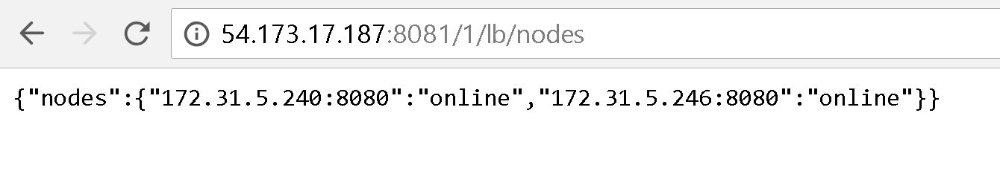

# Deploying Fn platform on AWS EC2 Instructions
## Fn load balancer
[load balancer suggestion spot request configs](images/lb-sri.png)

*Make sure to deploy in the same available zone and subnet with the Fn server nodes

[Open security group configures](images/open-sg.png) for easy setup which is **very unsecured**

Update ubuntu `sudo apt update && sudo apt upgrade`

Pick **install the package maintainer's version** if a promt comes up for configure file grub - probably doesn't matter

Install docker --> [instruction](https://docs.docker.com/install/linux/docker-ce/ubuntu/#install-docker-ce)

Install Go: `sudo apt install golang-go`

Install Glide:
```sh
sudo add-apt-repository ppa:masterminds/glide && sudo apt update
sudo apt install glide
```

[Build fnlb](https://github.com/fnproject/lb) docker image:

```
git clone https://github.com/fnproject/lb.git
cd lb
sudo make docker-build
```

*Create image for backup.

*Continue after [fnserver nodes](#fn-server-nodes) are up and running.

Run fnlb docker:
```sh
sudo docker run -d --name fnlb -p 8081:8081 fnproject/lb:latest ./fnlb -nodes xxx.xxx.xxx.xxx:8080, xxx.xxx.xxx.xxx:8080, <more-nodes>
```

Example with 2 nodes:
```sh
sudo docker run -d --name fnlb -p 8081:8081 fnproject/lb:latest ./fnlb -nodes 172.31.5.240:8080, 172.31.5.247:8080
```
Checking node status:
```sh
curl -sSL -X GET <fnlb_address>:8081/1/lb/nodes
```
or browser:


Add additional node:
```sh
curl -sSL -X PUT -d '{"node":"xxx.xxx.xxx.xxx:8080"}' <fnlb_address>:8081/1/lb/nodes
```
Delete node:
```sh
curl -sSL -X DELETE -d '{"node":"xxx.xxx.xxx.xxx:8080"}' <fnlb_address>:8081/1/lb/nodes
```

## Fn server nodes

Launch instance/spot instance

*Make sure to deploy in the same available zone and subnet with the Fnlb

Install docker --> [instruction](https://docs.docker.com/install/linux/docker-ce/ubuntu/#install-docker-ce)

Install [Fn server](https://github.com/fnproject/fn):
```sh
curl -LSs https://raw.githubusercontent.com/fnproject/cli/master/install | sh
```

*Create image for backup or later to create addition nodes

Start fn: `sudo fn start`

## cURL commands
```sh
# get app list
curl -X GET "http://<ipaddress>:8081/v1/apps" -H  "accept: application/json"
```


#### Links:

https://github.com/fnproject/fn

https://github.com/fnproject/lb